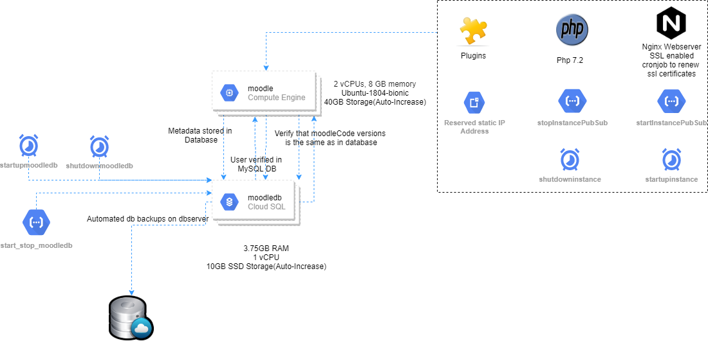

## Set-up Install Moodle

1.  **Create a GCP VM Instance**

2.  On the Google Cloud Platform dashboard, in the navigation pane, under
    **Compute**, click [Compute
    Engine](https://console.cloud.google.com/compute/).

3.  In the **Compute Engine VM instances** dialog box, click Create

    -   Name: *any_name_Org_convention*

    -   Region: c*losest_to_your_location – to reduce latency*

    -   Zone: *any_Zone*

    -   Machine Type: *Choose machine type to fit your need \>\> 1GB of memory
        per 50 users*

    -   Boot Disk: *Ubuntu \<any version\>*

    -   Identity and API access: *Allow full access to all Cloud APIs*

    -   Firewall: *Allow HTTP traffic & Allow HTTPS traffic*

Reserve your IP Address: Take note of the External IP of the newly created VM
Instance

Whenever you *restart or stop-start your instance a new IP address will get
assigned*. So, you must *reserve your external IP address as static*. Go to *VPC
Network* -\> *External IP addresses* and reserve the IP address.

-   Name: *any_name_Org_convention*

Once your instance is created and you have reserved your IP Address, SSH into
your VM:

Go to Compute Engine \>\> VM Instances page, here you will have your instances
listed. Click the SSH button to launch the terminal in a new browser window.

-   Install updates:

~~~~~~~~~~~~~~~~~~~~~~~~~~~~~~~~~~~~~~~~~~~~~~~~~~~~~~~~~~~~~~~~~~~~~~~~~~~~~~~~
sudo apt-get update
sudo apt-get upgrade -y
~~~~~~~~~~~~~~~~~~~~~~~~~~~~~~~~~~~~~~~~~~~~~~~~~~~~~~~~~~~~~~~~~~~~~~~~~~~~~~~~

-   Install Nginx

~~~~~~~~~~~~~~~~~~~~~~~~~~~~~~~~~~~~~~~~~~~~~~~~~~~~~~~~~~~~~~~~~~~~~~~~~~~~~~~~
sudo apt install nginx -y
~~~~~~~~~~~~~~~~~~~~~~~~~~~~~~~~~~~~~~~~~~~~~~~~~~~~~~~~~~~~~~~~~~~~~~~~~~~~~~~~

-   Verify that Nginx has been installed:

~~~~~~~~~~~~~~~~~~~~~~~~~~~~~~~~~~~~~~~~~~~~~~~~~~~~~~~~~~~~~~~~~~~~~~~~~~~~~~~~
nginx -v
~~~~~~~~~~~~~~~~~~~~~~~~~~~~~~~~~~~~~~~~~~~~~~~~~~~~~~~~~~~~~~~~~~~~~~~~~~~~~~~~

-   Install configure/ Firewall

>   The UFW package is normally installed with Ubuntu 18.04, need to add rules
>   which deny all incoming traffics and allow all out going traffics:

>   Add the ports for SSH (22), HTTP (80), HTTPS (443).

~~~~~~~~~~~~~~~~~~~~~~~~~~~~~~~~~~~~~~~~~~~~~~~~~~~~~~~~~~~~~~~~~~~~~~~~~~~~~~~~
    sudo ufw allow OpenSSH
    sudo ufw allow 'Nginx HTTP'
    sudo ufw allow 'Nginx HTTPS'
    sudo ufw enable -y
~~~~~~~~~~~~~~~~~~~~~~~~~~~~~~~~~~~~~~~~~~~~~~~~~~~~~~~~~~~~~~~~~~~~~~~~~~~~~~~~

To monitors intrusion attempts to your instance and blocks the offending host:

-   Install fail2ban and start the service

~~~~~~~~~~~~~~~~~~~~~~~~~~~~~~~~~~~~~~~~~~~~~~~~~~~~~~~~~~~~~~~~~~~~~~~~~~~~~~~~
sudo apt-get install fail2ban -y
sudo service fail2ban start
~~~~~~~~~~~~~~~~~~~~~~~~~~~~~~~~~~~~~~~~~~~~~~~~~~~~~~~~~~~~~~~~~~~~~~~~~~~~~~~~

\#\#\#\#\#\#\#\#\#\#\#\#\#\#\#\#\#\#\#\#\#\#\#\#\#\#\#\#\#\#\#\#\#\#\#\#\#\#\#\#\#\#\#\#\#\#\#\#\#\#\#\#\#\#\#\#\#\#\#\#\#\#\#\#\#\#\#\#\#\#\#\#\#\#\#\#\#\#\#\#\#\#

-   Open the Nginx config file and change the following fields:

~~~~~~~~~~~~~~~~~~~~~~~~~~~~~~~~~~~~~~~~~~~~~~~~~~~~~~~~~~~~~~~~~~~~~~~~~~~~~~~~
sudo nano /etc/nginx/nginx.conf
~~~~~~~~~~~~~~~~~~~~~~~~~~~~~~~~~~~~~~~~~~~~~~~~~~~~~~~~~~~~~~~~~~~~~~~~~~~~~~~~

>   **user \<current.user\>; worker_processes \<change amount to your VM core
>   number\>; multi_accept \<change to on\>; keepalive_timeout \<Change to 15\>;
>   server_tokens \< change to off \>; client_max_body_size \<Change value to
>   64m\>; \#gzip_proxied \<uncomment and set to value any\>; \#gzip_comp_level
>   \<uncomment and set tom value 2\>; \#gzip_types text/plain text/css
>   application/json application/javascript text/xml application/xml
>   application/xml+rss text/javascript; \<Uncomment\>**

>   **Add the below part directly below this line include
>   /etc/nginx/sites-enabled/\*;**

~~~~~~~~~~~~~~~~~~~~~~~~~~~~~~~~~~~~~~~~~~~~~~~~~~~~~~~~~~~~~~~~~~~~~~~~~~~~~~~~
server {
     listen 80 default_server;
     listen [::]:80 default_server;
     server_name \_;
     return 444;
}
~~~~~~~~~~~~~~~~~~~~~~~~~~~~~~~~~~~~~~~~~~~~~~~~~~~~~~~~~~~~~~~~~~~~~~~~~~~~~~~~

-   Check Nginx configuration and restart the service

~~~~~~~~~~~~~~~~~~~~~~~~~~~~~~~~~~~~~~~~~~~~~~~~~~~~~~~~~~~~~~~~~~~~~~~~~~~~~~~~
sudo nginx -t
sudo service nginx restart
~~~~~~~~~~~~~~~~~~~~~~~~~~~~~~~~~~~~~~~~~~~~~~~~~~~~~~~~~~~~~~~~~~~~~~~~~~~~~~~~

For Nginx to correctly serve PHP you also need to ensure the *fastcgi_param
SCRIPT_FILENAME* directive is set, otherwise, you will receive a blank white
screen when accessing any PHP scripts.

-   Open fastcgi_params file:

~~~~~~~~~~~~~~~~~~~~~~~~~~~~~~~~~~~~~~~~~~~~~~~~~~~~~~~~~~~~~~~~~~~~~~~~~~~~~~~~
sudo nano /etc/nginx/fastcgi_params*
~~~~~~~~~~~~~~~~~~~~~~~~~~~~~~~~~~~~~~~~~~~~~~~~~~~~~~~~~~~~~~~~~~~~~~~~~~~~~~~~

-   Add the following at the end of the file

    -   *fastcgi_param SCRIPT_FILENAME \$document_root\$fastcgi_script_name;*

Remove the default server blocks from Nginx. Otherwise you will get a 444-error
response

~~~~~~~~~~~~~~~~~~~~~~~~~~~~~~~~~~~~~~~~~~~~~~~~~~~~~~~~~~~~~~~~~~~~~~~~~~~~~~~~
    sudo rm /etc/nginx/sites-available/default
    sudo rm /etc/nginx/sites-enabled/default
~~~~~~~~~~~~~~~~~~~~~~~~~~~~~~~~~~~~~~~~~~~~~~~~~~~~~~~~~~~~~~~~~~~~~~~~~~~~~~~~

\#\#\#\#\#\#\#\#\#\#\#\#\#\#\#\#\#\#\#\#\#\#\#\#\#\#\#\#\#\#\#\#\#\#\#\#\#\#\#\#\#\#\#\#\#\#\#\#\#\#\#\#\#\#\#\#\#\#\#\#\#\#\#\#\#\#\#\#\#\#\#\#\#\#\#\#\#\#\#\#\#\#

-   Install PHP

~~~~~~~~~~~~~~~~~~~~~~~~~~~~~~~~~~~~~~~~~~~~~~~~~~~~~~~~~~~~~~~~~~~~~~~~~~~~~~~~
sudo apt-get install php7.2-fpm php7.2-common php7.2-mysql php7.2-xml
php7.2-xmlrpc php7.2-curl php7.2-gd php7.2-imagick php7.2-cli php7.2-dev
php7.2-imap php7.2-mbstring php7.2-opcache php7.2-soap php7.2-zip -y*
~~~~~~~~~~~~~~~~~~~~~~~~~~~~~~~~~~~~~~~~~~~~~~~~~~~~~~~~~~~~~~~~~~~~~~~~~~~~~~~~

-   Confirm that PHP is installed:

~~~~~~~~~~~~~~~~~~~~~~~~~~~~~~~~~~~~~~~~~~~~~~~~~~~~~~~~~~~~~~~~~~~~~~~~~~~~~~~~
php-fpm7.2 -v
~~~~~~~~~~~~~~~~~~~~~~~~~~~~~~~~~~~~~~~~~~~~~~~~~~~~~~~~~~~~~~~~~~~~~~~~~~~~~~~~

\#\#\#\#\#\#\#\#\#\#\#\#\#\#\#\#\#\#\#\#\#\#\#\#\#\#\#\#\#\#\#\#\#\#\#\#\#\#\#\#\#\#\#\#\#\#\#\#\#\#\#\#\#\#\#\#\#\#\#\#\#\#\#\#\#\#\#\#\#\#\#\#\#\#\#\#\#\#\#\#\#\#

-   Open the PHP config file to change the following fields:

~~~~~~~~~~~~~~~~~~~~~~~~~~~~~~~~~~~~~~~~~~~~~~~~~~~~~~~~~~~~~~~~~~~~~~~~~~~~~~~~
sudo nano /etc/php/7.2/fpm/pool.d/www.conf
~~~~~~~~~~~~~~~~~~~~~~~~~~~~~~~~~~~~~~~~~~~~~~~~~~~~~~~~~~~~~~~~~~~~~~~~~~~~~~~~

-   Change the following lines by replacing the www-data with your username.

>   user = **\<current user\>** group = **\<current user\>** listen.owner =
>   **\<current user\>** listen.group = **\<current user\>**

\#\#\#\#\#\#\#\#\#\#\#\#\#\#\#\#\#\#\#\#\#\#\#\#\#\#\#\#\#\#\#\#\#\#\#\#\#\#\#\#\#\#\#\#\#\#\#\#\#\#\#\#\#\#\#\#\#\#\#\#\#\#\#\#\#\#\#\#\#\#\#\#\#\#\#\#\#\#\#\#\#\#

-   Additional Configurations for PHP:

~~~~~~~~~~~~~~~~~~~~~~~~~~~~~~~~~~~~~~~~~~~~~~~~~~~~~~~~~~~~~~~~~~~~~~~~~~~~~~~~
sudo nano /etc/php/7.2/fpm/php.ini
~~~~~~~~~~~~~~~~~~~~~~~~~~~~~~~~~~~~~~~~~~~~~~~~~~~~~~~~~~~~~~~~~~~~~~~~~~~~~~~~

Press F6 for search inside the editor and update the following values

~~~~~~~~~~~~~~~~~~~~~~~~~~~~~~~~~~~~~~~~~~~~~~~~~~~~~~~~~~~~~~~~~~~~~~~~~~~~~~~~
    upload_max_filesize = 32M
    post_max_size = 48M
    memory_limit = 256M
    max_execution_time = 600
    max_input_vars = 1000
    max_input_time = 400
~~~~~~~~~~~~~~~~~~~~~~~~~~~~~~~~~~~~~~~~~~~~~~~~~~~~~~~~~~~~~~~~~~~~~~~~~~~~~~~~

-   Check if the configuration is correct and restart PHP

~~~~~~~~~~~~~~~~~~~~~~~~~~~~~~~~~~~~~~~~~~~~~~~~~~~~~~~~~~~~~~~~~~~~~~~~~~~~~~~~
sudo php-fpm7.2 -t
sudo service php7.2-fpm restart
~~~~~~~~~~~~~~~~~~~~~~~~~~~~~~~~~~~~~~~~~~~~~~~~~~~~~~~~~~~~~~~~~~~~~~~~~~~~~~~~

\#\#\#\#\#\#\#\#\#\#\#\#\#\#\#\#\#\#\#\#\#\#\#\#\#\#\#\#\#\#\#\#\#\#\#\#\#\#\#\#\#\#\#\#\#\#\#\#\#\#\#\#\#\#\#\#\#\#\#\#\#\#\#\#\#\#\#\#\#\#\#\#\#\#\#\#\#\#\#\#\#\#

Set up a *domain name* for the Site, or else you will be stuck with login in
with the External IP address and you won’t be able to setup a secure connection

\#\#\#\#\#\#\#\#\#\#\#\#\#\#\#\#\#\#\#\#\#\#\#\#\#\#\#\#\#\#\#\#\#\#\#\#\#\#\#\#\#\#\#\#\#\#\#\#\#\#\#\#\#\#\#\#\#\#\#\#\#\#\#\#\#\#\#\#\#\#\#\#\#\#\#\#\#\#\#\#\#\#

1.  **Create a cloud MySQL instance and connect to the VM instance**

2.  Go to SQL in the Navigation menu

3.  Click Create Instance

4.  Click Choose MySQL

5.  Fill in the *Instance info*

    1.  *Enter instance id (use a name that goes with the theme of the whole
        setup)*

    2.  *Enter root Password*

6.  Set the Region **(recommended to use same region you used for CE VM
    Instance)**

7.  Under Configuration options change the following\*\*:\*\*

    1.  **Click Connectivity, and under Authorized Networks click Add Networks**

        1.  *Enter a name in the Name field (Optional can be left blank)*

        2.  *Enter your GCE External IP address in the Network field*

    2.  **Click Machine type and storage**

        1.  *Change your machine type to what fits your organizational need*

        2.  *Select Storage type (SSD or HDD)*

        3.  *Change the Storage capacity to match your organization need (You
            can also select it to auto increase if storage nears capacity)*

        4.  *Leave Encryption on Google Managed Key*

    3.  *Leave the other settings as default and click create.*

-   Create a database and database user

    -   **Click on the Database tab and create a new database:**

1.  *Enter your database name (keep to the naming of the current setup)*

2.  *Set Character set to utf8mb4*

3.  *Leave the collation as default and click create.*

    -   After creating the database, click on Overview tab and click connect
        using Cloud Shell

        -   Once the Cloud shell is opened the **default gcloud command will be
            automatically populated and you need to hit enter**.

        -   You will be prompted to enter the password for root, enter root
            password

    -   Once logged into cloud mysql instance run the following commands

~~~~~~~~~~~~~~~~~~~~~~~~~~~~~~~~~~~~~~~~~~~~~~~~~~~~~~~~~~~~~~~~~~~~~~~~~~~~~~~~
CREATE USER 'username'\@'%' IDENTIFIED BY 'password';
GRANT ALL PRIVILEGES ON database_name.\* TO username\@'%';
FLUSH PRIVILEGES;
exit;*
~~~~~~~~~~~~~~~~~~~~~~~~~~~~~~~~~~~~~~~~~~~~~~~~~~~~~~~~~~~~~~~~~~~~~~~~~~~~~~~~

Where **username** is your username/or any other user and **password** is any
password you will remember and **database_name** is the database you just
created

\#\#\#\#\#\#\#\#\#\#\#\#\#\#\#\#\#\#\#\#\#\#\#\#\#\#\#\#\#\#\#\#\#\#\#\#\#\#\#\#\#\#\#\#\#\#\#\#\#\#\#\#\#\#\#\#\#\#\#\#\#\#\#\#\#\#\#\#\#\#\#\#\#\#\#\#\#\#\#\#\#\#

1.  **Setup your website**

SSH into your VM Instance and run these commands

-   Create folders and give permissions to the folders

~~~~~~~~~~~~~~~~~~~~~~~~~~~~~~~~~~~~~~~~~~~~~~~~~~~~~~~~~~~~~~~~~~~~~~~~~~~~~~~~
mkdir -p \<your_domain_name\>/logs \<your_domain_name\>/public
sudo chmod -R 755 \<your_domain_name\>*
~~~~~~~~~~~~~~~~~~~~~~~~~~~~~~~~~~~~~~~~~~~~~~~~~~~~~~~~~~~~~~~~~~~~~~~~~~~~~~~~

-   Install Intl PHP Extension - Moodle requires Intl PHP extension.

~~~~~~~~~~~~~~~~~~~~~~~~~~~~~~~~~~~~~~~~~~~~~~~~~~~~~~~~~~~~~~~~~~~~~~~~~~~~~~~~
sudo apt install php7.2-intl
~~~~~~~~~~~~~~~~~~~~~~~~~~~~~~~~~~~~~~~~~~~~~~~~~~~~~~~~~~~~~~~~~~~~~~~~~~~~~~~~

-   Download Moodle LMS

~~~~~~~~~~~~~~~~~~~~~~~~~~~~~~~~~~~~~~~~~~~~~~~~~~~~~~~~~~~~~~~~~~~~~~~~~~~~~~~~
cd \~/lms.strategicinsights.co.za/public*
curl -LO
https://download.moodle.org/download.php/stable39/moodle-latest-39.tgz
sudo tar xzvf moodle-latest-39.tgz*
sudo cp -a \~/\<domain_name\>/public/moodle/.
\~/\<domain_name\>/public
sudo rm -r \~/\<domain_name\>/public/moodle
- sudo rm -r \~/\<domain_name\>/public/moodle-latest-39.tgz
~~~~~~~~~~~~~~~~~~~~~~~~~~~~~~~~~~~~~~~~~~~~~~~~~~~~~~~~~~~~~~~~~~~~~~~~~~~~~~~~

-   Set Permissions and install file

~~~~~~~~~~~~~~~~~~~~~~~~~~~~~~~~~~~~~~~~~~~~~~~~~~~~~~~~~~~~~~~~~~~~~~~~~~~~~~~~
sudo chown -R \<username\> \~/\<domain_name\>/public
~~~~~~~~~~~~~~~~~~~~~~~~~~~~~~~~~~~~~~~~~~~~~~~~~~~~~~~~~~~~~~~~~~~~~~~~~~~~~~~~

-   NGINX configuration for Moodle LMS

>   Create a new Nginx config for your website in the sites-available directory

~~~~~~~~~~~~~~~~~~~~~~~~~~~~~~~~~~~~~~~~~~~~~~~~~~~~~~~~~~~~~~~~~~~~~~~~~~~~~~~~
sudo nano /etc/nginx/sites-available/\<domain_name\>
~~~~~~~~~~~~~~~~~~~~~~~~~~~~~~~~~~~~~~~~~~~~~~~~~~~~~~~~~~~~~~~~~~~~~~~~~~~~~~~~

-   Copy and paste the following configuration, ensure that you change the
    server_name, error_log and root directives to match your domain name.

~~~~~~~~~~~~~~~~~~~~~~~~~~~~~~~~~~~~~~~~~~~~~~~~~~~~~~~~~~~~~~~~~~~~~~~~~~~~~~~~
server {
       listen [::]:80;
       listen 80;

server_name \<domain_name\>;

error_log /home/\<username\>/\<domain_name\>/logs/error.log;
root /home/ home/\<username\>/\<domain_name\>/public/;
index index.php;
rewrite \^/(.\*.php)(/)(.\*)\$ /\$1?file=/\$3 last;

location / {
         try_files \$uri \$uri/ /index.php?\$args;
}

location /dataroot/ {
    internal; 
    alias /home//\<username\>/\<domain_name\>/public/moodledata/;
        }

location \~ .php\$ {
            try_files \$uri =404;
            fastcgi_split_path_info \^(.+.php)(/.+)\$;
            fastcgi_pass unix:/run/php/php7.2-fpm.sock;
            fastcgi_index index.php;
            include fastcgi_params;
            }
}
~~~~~~~~~~~~~~~~~~~~~~~~~~~~~~~~~~~~~~~~~~~~~~~~~~~~~~~~~~~~~~~~~~~~~~~~~~~~~~~~

\#\#\#\#\#\#\#\#\#\#\#\#\#\#\#\#\#\#\#\#\#\#\#\#\#\#\#\#\#\#\#\#\#\#\#\#\#\#\#\#\#\#\#\#\#\#\#\#\#\#\#\#\#\#\#\#\#\#\#\#\#\#\#\#\#\#\#\#\#\#\#\#\#\#\#\#\#\#\#\#\#\#

-   To enable this newly created website configuration run the below command

~~~~~~~~~~~~~~~~~~~~~~~~~~~~~~~~~~~~~~~~~~~~~~~~~~~~~~~~~~~~~~~~~~~~~~~~~~~~~~~~
sudo ln -s /etc/nginx/sites-available/\<domain_name\>
/etc/nginx/sites-enabled/\<domain_name\>
~~~~~~~~~~~~~~~~~~~~~~~~~~~~~~~~~~~~~~~~~~~~~~~~~~~~~~~~~~~~~~~~~~~~~~~~~~~~~~~~

-   Check if the configuration is correct and restart Nginx

~~~~~~~~~~~~~~~~~~~~~~~~~~~~~~~~~~~~~~~~~~~~~~~~~~~~~~~~~~~~~~~~~~~~~~~~~~~~~~~~
sudo nginx -t
sudo service nginx restart
~~~~~~~~~~~~~~~~~~~~~~~~~~~~~~~~~~~~~~~~~~~~~~~~~~~~~~~~~~~~~~~~~~~~~~~~~~~~~~~~

-   Create SSL certificate and enable HTTP/2

~~~~~~~~~~~~~~~~~~~~~~~~~~~~~~~~~~~~~~~~~~~~~~~~~~~~~~~~~~~~~~~~~~~~~~~~~~~~~~~~
sudo add-apt-repository ppa:certbot/certbot
sudo apt-get update
sudo apt-get install python-certbot-nginx
~~~~~~~~~~~~~~~~~~~~~~~~~~~~~~~~~~~~~~~~~~~~~~~~~~~~~~~~~~~~~~~~~~~~~~~~~~~~~~~~

-   To receive certificates run the below command

~~~~~~~~~~~~~~~~~~~~~~~~~~~~~~~~~~~~~~~~~~~~~~~~~~~~~~~~~~~~~~~~~~~~~~~~~~~~~~~~
sudo certbot certonly –nginx
~~~~~~~~~~~~~~~~~~~~~~~~~~~~~~~~~~~~~~~~~~~~~~~~~~~~~~~~~~~~~~~~~~~~~~~~~~~~~~~~

>   When prompted enter your email and agree to the terms and conditions, then
>   you will receive a list of domains you need to generate SSL certificates, to
>   select all domains just press Enter

\#\#\#\#\#\#\#\#\#\#\#\#\#\#\#\#\#\#\#\#\#\#\#\#\#\#\#\#\#\#\#\#\#\#\#\#\#\#\#\#\#\#\#\#\#\#\#\#\#\#\#\#\#\#\#\#\#\#\#\#\#\#\#\#\#\#\#\#\#\#\#\#\#\#\#\#\#\#\#\#\#\#

###### Redirect HTTP Traffic to HTTPS

~~~~~~~~~~~~~~~~~~~~~~~~~~~~~~~~~~~~~~~~~~~~~~~~~~~~~~~~~~~~~~~~~~~~~~~~~~~~~~~~
server {

    listen [::]:80;

    listen 80;

    server_name *\<your_domain\>*;

\# redirect http to https

    return 301 https://*\<your_domain\>*\$request_uri;

}

server {

    listen [::]:443 ssl http2;

    listen 443 ssl http2;

    server_name *\<your_domain\>;*

\# SSL code

    ssl_certificate /etc/letsencrypt/live/*\<your_domain\>*/fullchain.pem;

    ssl_certificate_key /etc/letsencrypt/live/*\<your_domain\>*/privkey.pem;

    error_log /home/*\<username\>*/*\<your_domain\>*/logs/error.log;

    root /home/*\<username\>*/*\<your_domain\>*/public/;

index index.php;

rewrite \^/(.\*.php)(/)(.\*)\$ /\$1?file=/\$3 last;

location / {

try_files \$uri \$uri/ /index.php?\$args;

}

location /dataroot/ {

internal;

alias /home/*\<username\>/\<your_domain\>*/public/moodledata/;

}

location \~\* .(svg\|svgz)\$ {

types {}

default_type image/svg+xml;

}

location = /favicon.ico {

log_not_found off;

access_log off;

}

location = /robots.txt {

allow all;

log_not_found off;

access_log off;

}

location \~ .php\$ {

try_files \$uri =404;

fastcgi_split_path_info \^(.+.php)(/.+)\$;

fastcgi_pass unix:/run/php/php7.2-fpm.sock;

fastcgi_index index.php;

include fastcgi_params;

add_header Content-Security-Policy "img-src \* 'self' data: blob: https:;
default-src 'self' https://.googleapis.com https://.googletagmanager.com
https://\*.google-analytics.com https://s.ytimg.com https://www.youtube.com
https://*\<your_domain\>* https://\*.googleapis.com https://.gstatic.com
https://.w.org data: 'unsafe-inline' 'unsafe-eval';" always;

add_header X-Xss-Protection "1; mode=block" always;

add_header X-Frame-Options "SAMEORIGIN" always;

add_header X-Content-Type-Options "nosniff" always;

add_header Access-Control-Allow-Origin "https://*\<your_domain\>*";

add_header Referrer-Policy "origin-when-cross-origin" always;

add_header Strict-Transport-Security "max-age=31536000; includeSubdomains;
preload";

}

location \~\* .(js\|css\|png\|jpg\|jpeg\|gif\|ico)\$ {

expires max;

log_not_found off;

}

location \~\* .(?:css\|js)\$ {

expires 7d;

add_header Cache-Control "no-cache, public, must-revalidate, proxy-revalidate";

}

location \~\* .(?:eot\|woff\|woff2\|ttf\|svg\|otf) {

expires 30d;

add_header Cache-Control "public";

types {font/opentype otf;}

types {application/vnd.ms-fontobject eot;}

types {font/truetype ttf;}

types {application/font-woff woff;}

types {font/x-woff woff2;}

}

}
~~~~~~~~~~~~~~~~~~~~~~~~~~~~~~~~~~~~~~~~~~~~~~~~~~~~~~~~~~~~~~~~~~~~~~~~~~~~~~~~

Now you have enabled **SSL Hardening**, created a **Content Security Policy,
X-XSS-Protection, Clickjacking, MIME Sniffing, Referrer Policy, Access Control
Allow Origin**.

-   Check if the configuration is correct and restart Nginx

~~~~~~~~~~~~~~~~~~~~~~~~~~~~~~~~~~~~~~~~~~~~~~~~~~~~~~~~~~~~~~~~~~~~~~~~~~~~~~~~
sudo nginx -t
sudo service nginx restart
~~~~~~~~~~~~~~~~~~~~~~~~~~~~~~~~~~~~~~~~~~~~~~~~~~~~~~~~~~~~~~~~~~~~~~~~~~~~~~~~

\#\#\#\#\#\#\#\#\#\#\#\#\#\#\#\#\#\#\#\#\#\#\#\#\#\#\#\#\#\#\#\#\#\#\#\#\#\#\#\#\#\#\#\#\#\#\#\#\#\#\#\#\#\#\#\#\#\#\#\#\#\#\#\#\#\#\#\#\#\#\#\#\#\#\#\#\#\#\#\#\#\#

-   Renew SSL certificate with cronjob

~~~~~~~~~~~~~~~~~~~~~~~~~~~~~~~~~~~~~~~~~~~~~~~~~~~~~~~~~~~~~~~~~~~~~~~~~~~~~~~~
sudo crontab -l \| { cat; echo "0 0,12 \* \* \* certbot renew
\>/dev/null 2\>\&1"; } \| sudo crontab –
~~~~~~~~~~~~~~~~~~~~~~~~~~~~~~~~~~~~~~~~~~~~~~~~~~~~~~~~~~~~~~~~~~~~~~~~~~~~~~~~

1.  **Setup Cloud SQL for Moodle LMS**

-   Install Moodle

    -   Visit your *domain_name* in your browser, the installation process will
        start

    -   Choose your preferred language, click Next

    -   Make sure theWeb address, moodle and data directory is correct;

        -   Web address: https://*\<domain_name\>*

        -   Moodle Directory: /home/*\<domain_name\>*/public

        -   Data Directory: /home/*\<domain_name\>*/public/moodledata

    -   Click Next

    -   In the choose database driver select *Improved MySQL(native/mysqli)*,
        click Next

    -   In the admin configuration enter your admin username and password

\#\#\#\#\#\#\#\#\#\#\#\#\#\#\#\#\#\#\#\#\#\#\#\#\#\#\#\#\#\#\#\#\#\#\#\#\#\#\#\#\#\#\#\#\#\#\#\#\#\#\#\#\#\#\#\#\#\#\#\#\#\#\#\#\#\#\#\#\#\#\#\#\#\#\#\#\#\#\#\#\#\#

1.  **Setting up cloud functions:**

    1.  Browse to google cloud functions,
        [here](https://console.cloud.google.com/functions/):

    2.  Click create Function,
        [here](https://console.cloud.google.com/functions/add):

    3.  Under **Basics** give your function a name and select the region closest
        to you, under **Trigger,** trigger type choose Cloud Pub/Sub and Select
        Cloud Pub/Sub topic if you don’t have any topics then select the option
        to create a topic

## Addendum:

### start_stop_moodle Database Code

#### main.py

~~~~~~~~~~~~~~~~~~~~~~~~~~~~~~~~~~~~~~~~~~~~~~~~~~~~~~~~~~~~~~~~~~~~~~~~~~~~~~~~
from googleapiclient import discovery
import google.auth

\#change this for a new project!!!

instance = 'moodle'  \# change this you your db instance name

\#now the main script        

credentials,project  = google.auth.default()

service = discovery.build('sqladmin', 'v1beta4', credentials=credentials,cache_discovery=False)

\#print("service: {}".format(service))

def start_stop_instance(event, context):

    """Background Cloud Function to be triggered by Pub/Sub.

    Args:

         event (dict):  The dictionary with data specific to this type of

         event. The \`data\` field contains the PubsubMessage message. The

         \`attributes\` field will contain custom attributes if there are any.

         context (google.cloud.functions.Context): The Cloud Functions event

         metadata. The \`event_id\` field contains the Pub/Sub message ID. The

         \`timestamp\` field contains the publish time.

         Refer to pub/sub tutorial https://cloud.google.com/functions/docs/tutorials/pubsub

    """

    import base64

    \#print("""This Function was triggered by messageId {} published at {}

    \#""".format(context.event_id, context.timestamp))

    \#get action: START\|STOP, passed in by cloud scheduler

    policy = 'ALWAYS'  \#default to start the instance

    if 'data' in event:

      action = base64.b64decode(event['data']).decode('utf-8')

    print('action received: {}'.format(action))

    if action.upper() == 'START':

      policy = 'ALWAYS'  \#default to start the instance

    elif action.upper() == 'STOP':

      policy = 'NEVER'  

    else:

      policy = 'ALWAYS'  

      print('received {} while START\|STOP is expected!'.format(action))

    \#Creating a request does not actually call the API. 

    \#Be aware that the API (e.g.https://cloud.google.com/sql/docs/postgres/admin-api/rest/v1beta4/instances/get) is for RESTful call,

    \# which is different from the Python client where "To execute the request and get a response, call the execute() function"

    \#refer to https://github.com/googleapis/google-api-python-client/blob/master/docs/start.md

    dbinstancebody = {
       "settings": {           
           "activationPolicy": policy
       }
    }

    request = service.instances().patch(
       project=project,
       instance=instance,
       body=dbinstancebody).execute()
~~~~~~~~~~~~~~~~~~~~~~~~~~~~~~~~~~~~~~~~~~~~~~~~~~~~~~~~~~~~~~~~~~~~~~~~~~~~~~~~

### requirements.txt

~~~~~~~~~~~~~~~~~~~~~~~~~~~~~~~~~~~~~~~~~~~~~~~~~~~~~~~~~~~~~~~~~~~~~~~~~~~~~~~~
google-api-python-client==1.10.0
google-auth-httplib2==0.0.4
google-auth==1.19.2
oauth2client==4.1.3
~~~~~~~~~~~~~~~~~~~~~~~~~~~~~~~~~~~~~~~~~~~~~~~~~~~~~~~~~~~~~~~~~~~~~~~~~~~~~~~~

## startInstancePubSub GCE VM Instance

### index.js

~~~~~~~~~~~~~~~~~~~~~~~~~~~~~~~~~~~~~~~~~~~~~~~~~~~~~~~~~~~~~~~~~~~~~~~~~~~~~~~~
const Compute = require('\@google-cloud/compute');
const compute = new Compute();

// [END functions_stop_instance_pubsub]

/\*\*

 \* Starts Compute Engine instances.
 \*
 \* Expects a PubSub message with JSON-formatted event data containing the

 \* following attributes:
 \*  zone - the GCP zone the instances are located in.
 \*  label - the label of instances to start.
 \*
 \* \@param {!object} event Cloud Function PubSub message event.
 \* \@param {!object} callback Cloud Function PubSub callback indicating
 \*  completion.

 \*/

exports.startInstancePubSub = async (event, context, callback) =\> {
  try {
    const payload = _validatePayload(
      JSON.parse(Buffer.from(event.data, 'base64').toString())
    );

    const options = {filter: \`labels.\${payload.label}\`};
    const [vms] = await compute.getVMs(options);
    await Promise.all(
      vms.map(async instance =\> {
        if (payload.zone === instance.zone.id) {
          const [operation] = await compute
            .zone(payload.zone)
            .vm(instance.name)
            .start();
          // Operation pending
          return operation.promise();
        }
      })
    );

    // Operation complete. Instance successfully started.

    const message = 'Successfully started instance(s)';
    console.log(message);
    callback(null, message);
  } catch (err) {
    console.log(err);
    callback(err);
  }
};

// [END functions_start_instance_pubsub]
// [START functions_stop_instance_pubsub]

/\*\*

 \* Stops Compute Engine instances.
 \*
 \* Expects a PubSub message with JSON-formatted event data containing the

 \* following attributes:
 \*  zone - the GCP zone the instances are located in.
 \*  label - the label of instances to stop.
 \*
 \* \@param {!object} event Cloud Function PubSub message event.
 \* \@param {!object} callback Cloud Function PubSub callback indicating completion
 \*/

exports.stopInstancePubSub = async (event, context, callback) =\> {
  try {
    const payload = _validatePayload(
      JSON.parse(Buffer.from(event.data, 'base64').toString())
    );
    const options = {filter: \`labels.\${payload.label}\`};
    const [vms] = await compute.getVMs(options);
    await Promise.all(
      vms.map(async instance =\> {
        if (payload.zone === instance.zone.id) {
          const [operation] = await compute
            .zone(payload.zone)
            .vm(instance.name)
            .stop();

          // Operation pending

          return operation.promise();
        } else {
          return Promise.resolve();
        }
      })
    );

    // Operation complete. Instance successfully stopped.

    const message = 'Successfully stopped instance(s)';
    console.log(message);
    callback(null, message);
  } catch (err) {
    console.log(err);
    callback(err);
  }
};

// [START functions_start_instance_pubsub]

/\*\*

 \* Validates that a request payload contains the expected fields.

 \*

 \* \@param {!object} payload the request payload to validate.

 \* \@return {!object} the payload object.
 \*/
const _validatePayload = payload =\> {
  if (!payload.zone) {
    throw new Error("Attribute 'zone' missing from payload");
  } else if (!payload.label) {
    throw new Error("Attribute 'label' missing from payload");
  }
  return payload;
};

// [END functions_start_instance_pubsub]
// [END functions_stop_instance_pubsub]
~~~~~~~~~~~~~~~~~~~~~~~~~~~~~~~~~~~~~~~~~~~~~~~~~~~~~~~~~~~~~~~~~~~~~~~~~~~~~~~~

### packages.json

~~~~~~~~~~~~~~~~~~~~~~~~~~~~~~~~~~~~~~~~~~~~~~~~~~~~~~~~~~~~~~~~~~~~~~~~~~~~~~~~
{
  "name": "cloud-functions-schedule-instance",
  "version": "0.1.0",
  "private": true,
  "license": "Apache-2.0",
  "author": "Google Inc.",
  "repository": {
    "type": "git",
    "url": "https://github.com/GoogleCloudPlatform/nodejs-docs-samples.git"
  },
  "engines": {
    "node": "\>=10.0.0"
  },
  "scripts": {
    "test": "mocha test/\*.test.js --timeout=20000"
  },
  "devDependencies": {
    "mocha": "\^8.0.0",
    "proxyquire": "\^2.0.0",
    "sinon": "\^9.0.0"
  },
  "dependencies": {
    "\@google-cloud/compute": "\^2.0.0"
  }
}
~~~~~~~~~~~~~~~~~~~~~~~~~~~~~~~~~~~~~~~~~~~~~~~~~~~~~~~~~~~~~~~~~~~~~~~~~~~~~~~~

## stopInstancePubSub GCE VM Instance

### index.js

~~~~~~~~~~~~~~~~~~~~~~~~~~~~~~~~~~~~~~~~~~~~~~~~~~~~~~~~~~~~~~~~~~~~~~~~~~~~~~~~
const Compute = require('\@google-cloud/compute');
const compute = new Compute();

// [END functions_stop_instance_pubsub]
/\*\*
 \* Starts Compute Engine instances.
 \*
 \* Expects a PubSub message with JSON-formatted event data containing the
 \* following attributes:
 \*  zone - the GCP zone the instances are located in.
 \*  label - the label of instances to start.
 \*
 \* \@param {!object} event Cloud Function PubSub message event.
 \* \@param {!object} callback Cloud Function PubSub callback indicating
 \*  completion.
 \*/
exports.startInstancePubSub = async (event, context, callback) =\> {
  try {
    const payload = _validatePayload(
      JSON.parse(Buffer.from(event.data, 'base64').toString())
    );
    const options = {filter: \`labels.\${payload.label}\`};
    const [vms] = await compute.getVMs(options);
    await Promise.all(
      vms.map(async instance =\> {
        if (payload.zone === instance.zone.id) {
          const [operation] = await compute
            .zone(payload.zone)
            .vm(instance.name)
            .start();
          // Operation pending
          return operation.promise();
        }
      })
    );
    // Operation complete. Instance successfully started.

    const message = 'Successfully started instance(s)';
    console.log(message);
    callback(null, message);
  } catch (err) {
    console.log(err);
    callback(err);
  }
};
// [END functions_start_instance_pubsub]

// [START functions_stop_instance_pubsub]
/\*\*
 \* Stops Compute Engine instances.
 \*
 \* Expects a PubSub message with JSON-formatted event data containing the
 \* following attributes:
 \*  zone - the GCP zone the instances are located in.
 \*  label - the label of instances to stop.
 \*
 \* \@param {!object} event Cloud Function PubSub message event.
 \* \@param {!object} callback Cloud Function PubSub callback indicating completion

 \*/

exports.stopInstancePubSub = async (event, context, callback) =\> {
  try {
    const payload = _validatePayload(
      JSON.parse(Buffer.from(event.data, 'base64').toString())
    );
    const options = {filter: \`labels.\${payload.label}\`};
    const [vms] = await compute.getVMs(options);
    await Promise.all(
      vms.map(async instance =\> {
        if (payload.zone === instance.zone.id) {
          const [operation] = await compute
            .zone(payload.zone)
            .vm(instance.name)
            .stop();
          // Operation pending

          return operation.promise();
        } else {
          return Promise.resolve();
        }
      })
    );
    // Operation complete. Instance successfully stopped.

    const message = 'Successfully stopped instance(s)';
    console.log(message);
    callback(null, message);
  } catch (err) {
    console.log(err);
    callback(err);
  }
};
// [START functions_start_instance_pubsub]
/\*\*

 \* Validates that a request payload contains the expected fields.
 \*
 \* \@param {!object} payload the request payload to validate.
 \* \@return {!object} the payload object.
 \*/
const _validatePayload = payload =\> {
  if (!payload.zone) {
    throw new Error("Attribute 'zone' missing from payload");
  } else if (!payload.label) {
    throw new Error("Attribute 'label' missing from payload");
  }
  return payload;
};
// [END functions_start_instance_pubsub]
// [END functions_stop_instance_pubsub]

### packages.json
{
  "name": "cloud-functions-schedule-instance",
  "version": "0.1.0",
  "private": true,
  "license": "Apache-2.0",
  "author": "Google Inc.",
  "repository": {
    "type": "git",
    "url": "https://github.com/GoogleCloudPlatform/nodejs-docs-samples.git"
  },
  "engines": {
    "node": "\>=10.0.0"
  },
  "scripts": {
    "test": "mocha test/\*.test.js --timeout=20000"
  },
  "devDependencies": {
    "mocha": "\^8.0.0",
    "proxyquire": "\^2.0.0",
    "sinon": "\^9.0.0"
  },
  "dependencies": {
    "\@google-cloud/compute": "\^2.0.0"
  }
}
~~~~~~~~~~~~~~~~~~~~~~~~~~~~~~~~~~~~~~~~~~~~~~~~~~~~~~~~~~~~~~~~~~~~~~~~~~~~~~~~

References:

<https://moodle.org/mod/forum/discuss.php?d=345075>

<https://docs.moodle.org/39/en/Tools_for_backing_up_server_files>

<https://docs.moodle.org/39/en/Managing_accounts>

<https://docs.moodle.org/39/en/Configuration_file>

<https://docs.moodle.org/39/en/Administration_via_command_line>

<https://docs.moodle.org/39/en/Installing_Moodle>

<https://docs.moodle.org/39/en/Installation_FAQ>

<https://git.moodle.org/gw?p=moodle.git;a=tree;f=admin/tool/usertours;h=15beb04da4d42eac6668509e5878a54bedbf7d83;hb=refs/heads/MOODLE_39_STABLE>

<https://docs.moodle.org/39/en/Cron_with_Unix_or_Linux>

<https://cloud.google.com/scheduler/docs/configuring/cron-job-schedules?&_ga=2.8188465.-225819083.1585300639#defining_the_job_schedule>

<https://cloud.google.com/functions/docs/tutorials/pubsub>

<https://cloud.google.com/scheduler/docs/start-and-stop-compute-engine-instances-on-a-schedule#gcloud>

<https://www.base64encode.org/>

<https://aus800.com.au/use-cloud-function-to-start-and-stop-cloud-sql/>

<https://cloud.google.com/scheduler/docs/start-and-stop-compute-engine-instances-on-a-schedule>

<https://crontab.guru/>

<https://cloud.google.com/scheduler/docs/configuring/cron-job-schedule>
